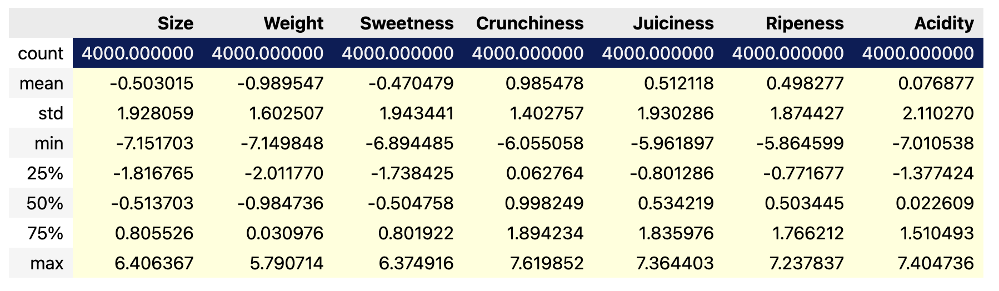
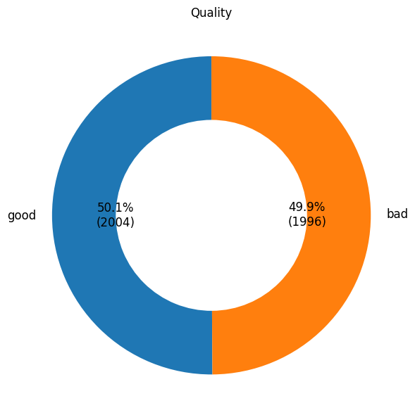
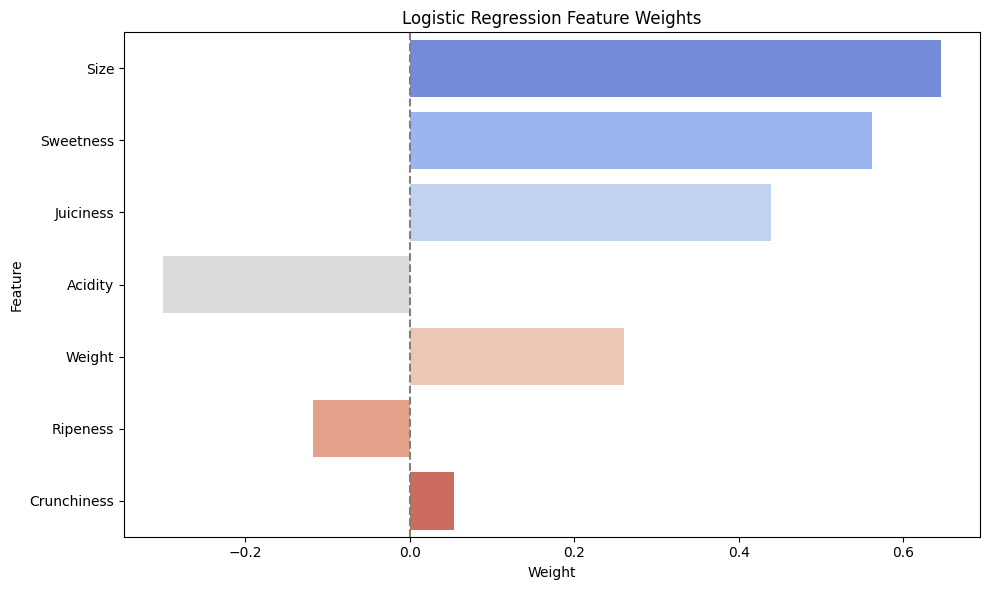

# SKN14-EDA-2Team

## 1. 프로젝트 개요
- 목적: 사과 품질 예측을 위한 데이터 구조 파악 및 AI 모델링
- 데이터 출처: [Kaggle - Apple Quality](https://www.kaggle.com/datasets/nelgiriyewithana/apple-quality)
- 데이터 구성: 총 9개 컬럼, 4000개 행

## 2. 데이터 기본 정보
- 총 데이터 수: 4000개
- 컬럼 수: 9개

| 번호 | 속성명         | 의미              |
|------|-------------|------------------|
| 1    | A_id        | 과일 ID           |
| 2    | Size        | 크기              |
| 3    | Weight      | 무게              |
| 4    | Sweetness   | 단맛              |
| 5    | Crunchiness | 바삭함             |
| 6    | Juiciness   | 육즙              |
| 7    | Ripeness    | 숙성도             |
| 8    | Acidity     | 산도              |
| 9    | Quality     | 품질              |

## 3. 기술 통계요약

### 수치형 변수

- Apple Quality 데이터는 Z-score 기반 표준화가 적용된 상태로 제공되었다.
- 따라서 평균과 표준편차를 모르는 이상 원시 데이터를 복원하는 것은 불가능하다.

$$
Z = \frac{X - \mu}{\sigma}
$$

### 범주형 변수

## 4. 결측치 및 이상치 탐색
(조사중)

## 5. 변수 간 관계 분석

## 6. 파생 변수 및 전처리
`A_id` → 고유번호 삭제

## 7. 요약 및 인사이트
-
-