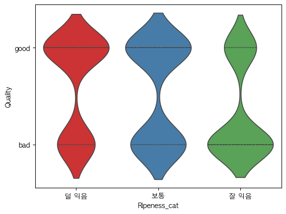

# SKN14-EDA-2Team

## 1. 프로젝트 개요
- 목적: 사과 품질 예측을 위한 데이터 구조 파악 및 AI 모델링
- 데이터 출처: [Kaggle - Apple Quality](https://www.kaggle.com/datasets/nelgiriyewithana/apple-quality)
- 데이터 구성: 총 9개 컬럼, 4000개 행

## 2. 데이터 기본 정보
- 총 데이터 수: 4000개
- 컬럼 수: 9개

| 컬럼 이름    | 자료형    | 한글 이름    | 타입        | 역할      | 설명                      |
|--------------|-----------|--------------|-------------|-----------|---------------------------|
| A_id         | float64   | 과일 ID      | 수치형      | Feature   | 고유 식별자               |
| Size         | float64   | 크기         | 수치형      | Feature   | 과일의 크기               |
| Weight       | float64   | 무게         | 수치형      | Feature   | 과일의 무게               |
| Sweetness    | float64   | 당도         | 수치형      | Feature   | 과일의 단맛 정도          |
| Crunchiness  | float64   | 아삭함       | 수치형      | Feature   | 과일의 아삭한 정도        |
| Juiciness    | float64   | 과즙 함량    | 수치형      | Feature   | 과일의 즙이 많은 정도     |
| Ripeness     | float64   | 숙성도       | 수치형      | Feature   | 과일의 익은 정도          |
| Acidity      | object    | 산도         | 범주형      | Feature   | 과일의 신맛 정도 (Low, Medium 등) |
| Quality      | object    | 품질         | 범주형      | Target    | 과일의 품질 평가 (Good, Bad 등)   |

## 3. 기술 통계요약

### 수치형 변수

- Apple Quality 데이터는 Z-score 기반 표준화가 적용된 상태로 제공되었다.
- 따라서 평균과 표준편차를 모르는 이상 원시 데이터를 복원하는 것은 불가능하다.

$$
Z = \frac{X - \mu}{\sigma}
$$

### 범주형 변수

## 4. 결측치 및 이상치 탐색

### 결측치 : 없음

### 이상치 (조사중)

## 5. 변수 간 관계 분석

> ## 숙성도(Ripeness)와 품질(Quality) 간의 관계 분석
>
> - 숙성도를 `덜 익음`, `보통`, `잘 익음`의 **3구간으로 분류**했을 때,
>   품질과의 관계가 다음과 같이 나타남
>
>   - `덜 익음` 또는 `보통` 구간일수록 **품질이 좋은 비율이 높음**
>   - 반대로, `잘 익음` 구간에서는 **품질이 낮은 경우가 많음**
>
> ### 인사이트
>
> 너무 잘 익으면 과일의 품질이 떨어질 수 있다는 것을 시사함.  
> 즉, **적당히 익었을 때**가 가장 **좋은 품질의 상태**일 가능성이 높음.

- **Size와 Sweetness**  
  → 음의 상관관계 **(-0.32)**  
  → 크기가 작을수록 단맛이 높은 경향이 있음

- **Ripeness와 Weight**  
  → 음의 상관관계 **(-0.24)**  
  → 익을수록 무게가 줄어드는 경향이 있음

- **Ripeness와 Sweetness**  
  → 음의 상관관계 **(-0.27)**  
  → 익을수록 단맛이 떨어지는 경향이 있음

- **Ripeness와 Crunchiness**  
  → 음의 상관관계 **(-0.20)**  
  → 익을수록 아삭함이 떨어지는 경향이 있음

- **Crunchiness와 Juiciness**  
  → 음의 상관관계 **(-0.26)**  
  → 아삭할수록 즙이 적은 경향이 있음

- **Ripeness와 Acidity**  
  → 음의 상관관계 **(-0.20)**  
  → 덜 익을수록 산도가 높은 경향이 있음

- **Juiciness와 Acidity**  
  → 양의 상관관계 **(0.25)**  
  → 즙이 많을수록 산도가 높은 경향이 있음

## 6. 파생 변수 및 전처리

### 파생변수

> 양의 상관관계가 있는 `size`, `sweetness`, `juiciness`를 묶어  
> 새로운 요소 `taste score`로 만들어 `quality`와의 관계를 확인

### 전처리
`A_id` → 고유번호 삭제

## 7. 요약 및 인사이트

> ## 품질(Quality)과 주요 변수 간의 관계 분석
>
> - **Size**, **Sweetness**, **Juiciness**는 모두 **Quality와 양의 상관관계**를 보임  
>   → 세 변수의 값이 클수록 `Quality = 1` ("good")일 확률이 **높아지는 경향** 있음
>
> ### 주요 해석 포인트
>
> - ✅ **Size**와 **Sweetness**는 높은 양의 상관계수  
>   → 두 변수 모두 **품질을 결정짓는 데 강한 영향력**을 가짐
>
> - ✅ **Juiciness** 역시 양의 관계이나, 영향력은 약간 더 낮음
>
> - ✅ ripeness에서 quality와 음의 상관관계가 있음.
>
> ### 결론
>
> `크기(Size)`와 `단맛(Sweetness)`은 과일의 품질을 판단하는데  
> 가장 중요한 요소이며, **Juiciness**도 일정 수준 기여함